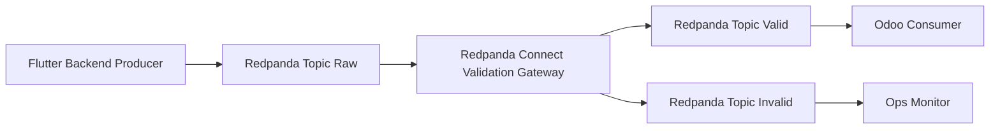

# Redpanda Connect POC Design

## Objective
Membuat validation gateway sebelum Odoo consume event, dengan alur:
- Backend publish ke topic raw
- Redpanda Connect validasi dan route
- Odoo hanya consume topic valid

## Scope
- Mengganti layer filtering dari Flink ke Redpanda Connect
- Fokus pada validasi event penerimaan unit
- Menjaga kompatibilitas payload CloudEvent dari aplikasi

## Target Topics
1. `vehicle.received.raw`
   - Input dari backend
2. `vehicle.received.valid`
   - Output event lolos validasi
3. `vehicle.received.invalid`
   - Output event gagal validasi beserta alasan
4. `vehicle.received.audit`
   - Optional trail untuk observability

## Contract Ringkas per Topic
### Raw
Payload CloudEvent existing dari frontend dan backend.

### Valid
Payload tetap CloudEvent, ditambah metadata validasi:
- `validation_status=valid`
- `validation_version=v1`
- `validated_at`

### Invalid
Payload berisi event asli plus detail error:
- `validation_status=invalid`
- `reasons[]`
- `failed_stage`
- `validated_at`

## Validation Rules POC
### Envelope wajib
- `specversion`
- `type`
- `source`
- `subject`
- `id`
- `time`
- `data`

### Data wajib
- `data.receiving_context.warehouse_id`
- `data.receiving_context.inspector_id`
- `data.received_items` harus list dan tidak kosong

### Item wajib
Setiap item wajib punya:
- `vin`
- `model`
- `odometer`
- `condition`
- `received_at`

### Rule bisnis minimum
- `odometer >= 0`
- `condition` hanya `Grade A`, `Grade B`, `Grade C`
- `vin` uppercase alnum, panjang minimum 10
- `type` harus `com.arista.vehicle.inventory.received.v1`

## Dedup Strategy POC
Dedup ringan berbasis kunci:
- `event_id + vin`

Strategi:
- Jika key sudah pernah diproses dalam window pendek, route ke invalid dengan reason `duplicate_event_item`
- Jika belum, route normal ke valid

Catatan:
- Untuk POC boleh dilakukan di Odoo consumer atau cache ringan di gateway
- Untuk production disarankan dedup stateful external store

## Odoo Consumption Model
- Odoo consumer hanya subscribe `vehicle.received.valid`
- Odoo tidak membaca `raw`
- Odoo tidak membaca `invalid` untuk transaksi, hanya untuk dashboard operasional

### Mapping ke Odoo
- `subject` untuk referensi PO
- `received_items[].vin` untuk lot serial
- `warehouse_id` untuk destination location
- `condition` dan `odometer` untuk custom field move line

## Error Handling dan Governance
- Semua event invalid masuk `vehicle.received.invalid`
- Sertakan reason code yang konsisten
- Simpan sampling invalid ke `vehicle.received.audit`
- Siapkan reprocess path dari invalid ke raw setelah koreksi

## Security
- ACL terpisah per topic
- Odoo principal hanya read `vehicle.received.valid`
- Gateway principal read `raw` dan write `valid` plus `invalid`

## Observability Minimum
- Counter total raw
- Counter valid
- Counter invalid
- Top reason invalid
- Consumer lag Odoo di topic valid

## Mermaid Flow

## Delivery Plan Tahap 1 POC
- Buat topic raw valid invalid audit
- Deploy satu pipeline Redpanda Connect read raw write valid invalid
- Implement rule validasi minimum dan reason code
- Ubah Odoo consumer agar hanya read topic valid
- Tambahkan dashboard metrik minimum untuk valid invalid
- Jalankan uji skenario PO 003 004 005

## Delivery Plan Tahap 2 Hardening
- Tambah schema governance versioning
- Upgrade dedup ke stateful store
- Tambah replay job invalid ke raw dengan approval
- Tambah alerting SLO dan anomaly detection
- Tambah kontrak data untuk tim ERP dan audit

## Acceptance Criteria
- Event valid tidak lagi ditolak Odoo karena field wajib hilang
- Event invalid tidak masuk proses transaksi Odoo
- Tersedia alasan reject yang bisa ditindaklanjuti
- Throughput POC stabil untuk batch scan uji lapangan
